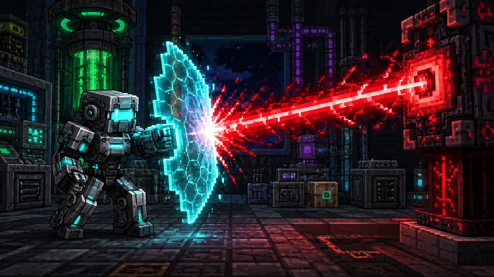

# Mekanism: Extra Modules

A Mekanism addon that expands its modular gear with new abilities.

The current release adds three MekaSuit body modules focused on endgame protection. All three use Mekanism's native module energy system and are installed in the MekaSuit body armor.

## Modules

### Phase Guard Unit

Keeps the suit in a protected state while the module is enabled and powered.

- Energy use: **500 kFE/t** while active.
- Condition: the module must be installed, enabled in the Mekanism module UI, and able to draw energy.
- Effect: cancels incoming damage paths and death events that normal armor may not stop.
- HUD: shows active or inactive state through Mekanism's native module HUD.

### Chaos Anchor Unit

Extra protection for Draconic Evolution's Chaos Guardian laser behavior.

- Energy use: no separate drain; it relies on **Phase Guard** being active.
- Condition: Chaos Anchor must be installed, Phase Guard must be enabled and powered, and the configured suit requirements must pass.
- Effect: blocks the Chaos Guardian laser's direct health-write and death bypass path.

### Emergency Revival Unit

Last-second recovery when a hit would kill the player.

- Energy use: **10 MFE** per trigger.
- Condition: the module must be installed, enabled in the Mekanism module UI, and able to draw enough energy at the lethal hit.
- Effect: cancels death, restores **4 health**, and applies short totem-style survival effects.

## Configuration

Every gameplay value is configurable per world in `serverconfig/mekanism_extra_modules-server.toml`. Dedicated servers store it under `<world>/serverconfig`; single-player worlds store it in the world's `serverconfig` directory.

Energy values in this file are expressed in Forge Energy (FE) and are converted through Mekanism's configured FE-to-Joules conversion before being consumed.

The generated file documents every option and its valid range. Server owners can tune the modules from forgiving single-player defaults to stricter expert-pack balance.

## Notes

- Items are registered into the Mekanism Tools creative tab.
- Phase Guard is controlled through Mekanism's module UI.

## License

Licensed under the GNU Lesser General Public License v3.0 or later (`LGPL-3.0-or-later`). See [LICENSE](LICENSE).
